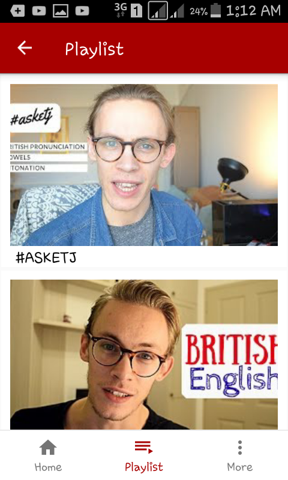

# MyTube
this is a template app, it  helps the youtuber become closer to their followers.

if you want use this code: 

* you should write your key in local.properties.

* write the "channel-id" on the service file (network/service) in Channelid variable.

