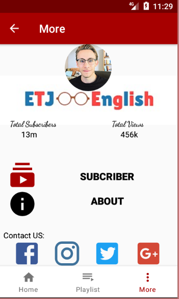
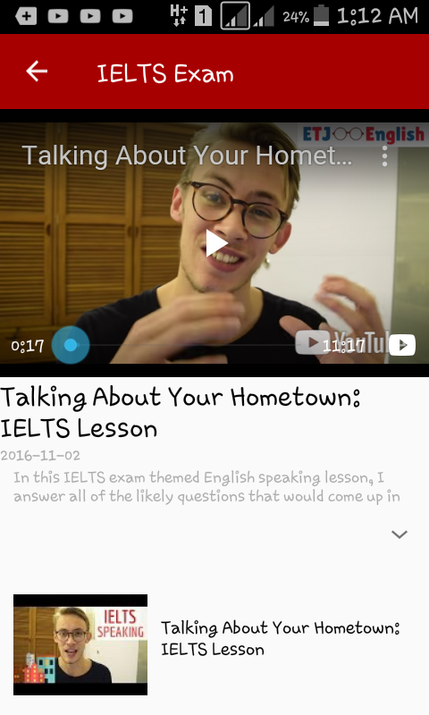

# MyTube
this is a template app, it  helps the youtuber become closer to their followers.

if you want use this code: 

* you should write your key in local.properties.

* write the "channel-id" on the service file (network/service) in Channelid variable.

   Copyright 2020 Amina Bekir

   Licensed under the Apache License, Version 2.0 (the "License");
   you may not use this file except in compliance with the License.
   You may obtain a copy of the License at

       http://www.apache.org/licenses/LICENSE-2.0

   Unless required by applicable law or agreed to in writing, software
   distributed under the License is distributed on an "AS IS" BASIS,
   WITHOUT WARRANTIES OR CONDITIONS OF ANY KIND, either express or implied.
   See the License for the specific language governing permissions and
   limitations under the License.
